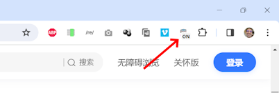
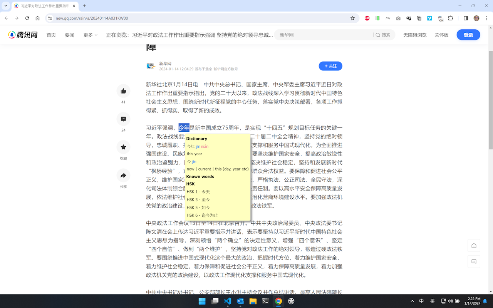
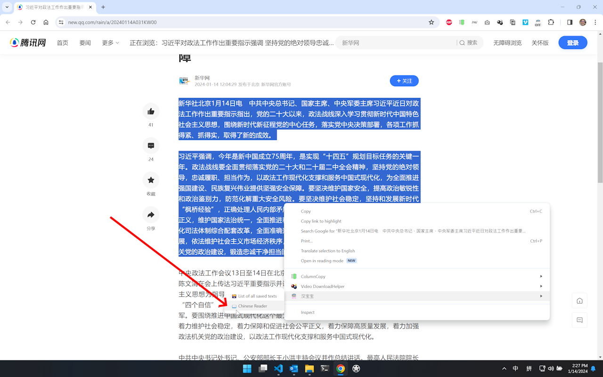
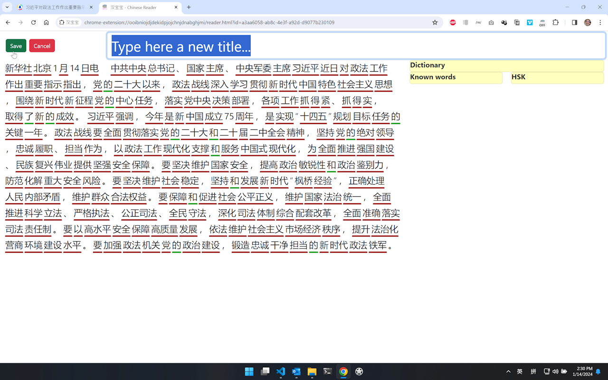
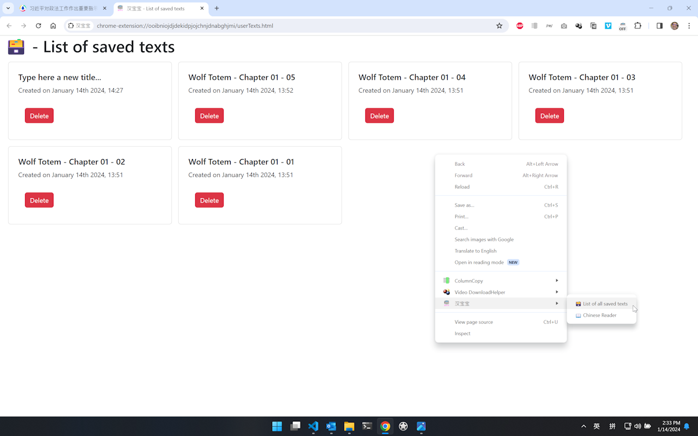
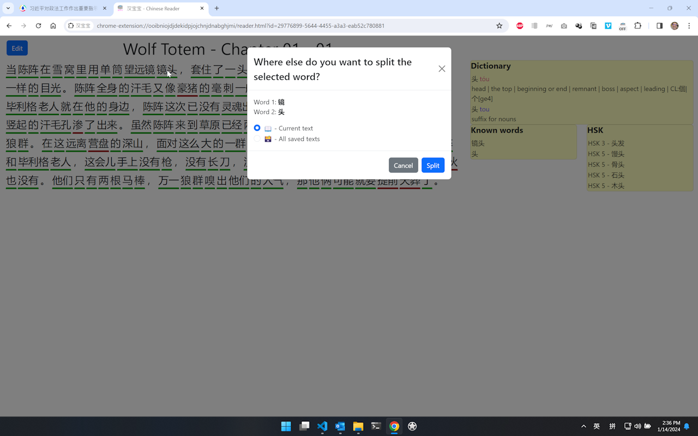

# 汉宝宝

Google Chrome extension that helps you learn Chinese, by providing a dictionary and keeping track of known words.

# Use as a dictionary

Turn on the extension by clicking on it in the toolbar.

Hover over a word to see its definition.

# Use as a reader

Select the text you want to segment, and click on the context menu item to have it automatically segmented.

Now you can set a custom title for the text.

You can always retrieve all the saved texts by clicking the menu item.

# Hotkeys

When using the Chinese reader, you can use the following hotkeys to manage known/unknown words:

* **1** - Mark the word as *unknown*.
* **2** - Mark the word as *known*.

Use the following hotkeys to split/merge multi-character words:

* **Z** - Split the word at the cursor.
* **X** - Merge the *selected* words into a single word.

In addition, you can perform the operations of split/merge globally on the currently open text or all the saved texts.

* **N** - Split the word globally
* **M** - Merge the *selected* words globally

A popup window will ask you to confirm the operation.

When you hover over a character, it will show you known words that contain that character; this helps making connections between words in your mind.

# Known bugs

- [ ] The dictionary's position is always to the bottom right with respect to the cursor. We should make it appear to the left in case the mouse is on the right side of the screen. The same goes for when the mouse is at the bottom of the screen.
- [ ] The dictionary's position when using the reader does not scroll down when the text is too long.

# Features

- [ ] Add the possibility to export/import all the settings and the saved texts.

# Credits

The dictionary is based on the [CC-CEDICT](https://cc-cedict.org/wiki/) project.

It uses the [Jieba](https://github.com/hermanschaaf/jieba-js) Chinese word segmentation library.

Boilerplate from [Chrome Extension (MV3) Boilerplate with React 18 and Webpack 5](https://github.com/lxieyang/chrome-extension-boilerplate-react/) by Michael Xieyang Liu.